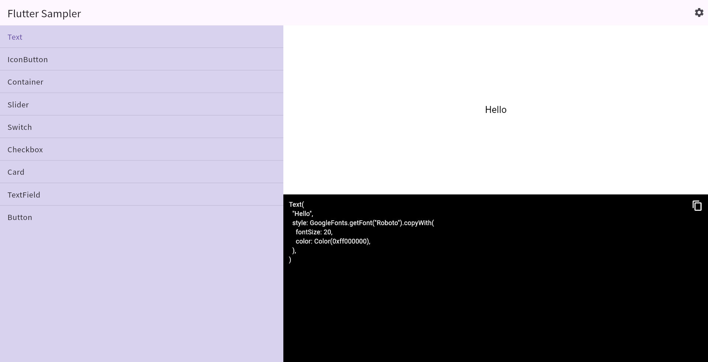

# Flutter UI Catalog

## 🇯🇵 日本語

このプロジェクトは、趣味でプログラミングを行っている作者が  
FlutterのWidget学習および検証のために作成したUIカタログアプリです。

Flutterの各種Widgetを実際に操作しながら確認できるように設計しており、  
学習用途だけでなく、簡易的なUI部品作成ツールとしても利用できます。

### 🌐 Web版（Live Demo）

👉 https://kyokocow.github.io/flutter_ui_catalog/

## 📸 Screenshot

---

## 🧩 特徴

- Flutter Widgetの動作確認が可能
- 各Widgetのプロパティをリアルタイムに変更可能
- カラーパレット機能あり
- フォント切り替え機能あり
- UIコンポーネントの試作・検証に利用可能

---

## ⚠️ 注意

本プロジェクトはまだ発展途上です。  
一部機能は未完成、または動作が不安定な場合があります。

今後も継続的に改善・拡張していく予定です。

---

# 🇬🇧 English

## Flutter UI Catalog

This project is a UI catalog application created by a hobby programmer  
for learning and experimenting with Flutter Widgets.

It allows interactive testing of various Flutter Widgets and their properties,  
and can also be used as a lightweight tool for building and prototyping UI components.

---

## 🌐 Web Demo

👉 https://kyokocow.github.io/flutter_ui_catalog/

---

## 🧩 Features

- Interactive Flutter Widget preview
- Real-time property editing
- Color palette system
- Font switching support
- Useful for UI prototyping and experimentation

---

## ⚠️ Note

This project is still under development.  
Some features may be incomplete or unstable.

Continuous improvements and updates are planned.

---

## 👤 Author

A personal hobby project developed for learning Flutter.
